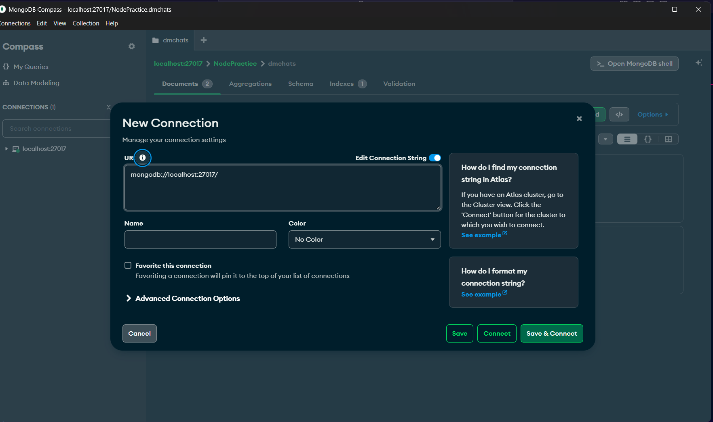

## Connection
Our mongodb server usally run on 
```
mongodb://localhost:27017
```
You can also see that by creating a new connection



## Connecting mongodb (js)
First we import mongoose module
```js
import mongoose from "mongoose"
```
Then we call connect method on it and give your localhost url followed by Our Database name
```js
import mongoose from "mongoose"

// async fnc start
await mongoose.connect("mongodb://localhost:27017/niggstagram")  // it's a async function
// fnc end

export {mongoose}
```
ok so after connecting to the database , we exporting the mongoose cause we need this instance to create and fetch data   
remember the instance you connected is what you can use for retrieving data and create it... creating another instances is not recommender or intended..
